# Spring for Apache Pulsar
## Unified Messaging at Scale

---

## What if you could...

- **Unify**: Pub/Sub + Queuing + Streaming in one platform
- **Scale**: Multi-region without operational headaches
- **Isolate**: Multi-tenant resources with native isolation

---

## What is Apache Pulsar?

Distributed pub/sub and streaming platform built for modern cloud architectures.

**Key Features:**
- Layered architecture: Brokers + BookKeeper storage
- Native multi-tenancy with resource isolation
- Active-active geo-replication across regions
- Multiple consumption patterns (exclusive, shared, failover, key-shared)

---

## Architecture

**Three-Layer Design:**

- **Brokers**: Stateless routing layer handling pub/sub logic
- **BookKeeper**: Distributed durable log storage (separation of concerns)
- **ZooKeeper**: Cluster metadata and coordination

**Architecture Diagram:**


---

## Pulsar vs. Alternatives

| Feature          | Kafka | RabbitMQ | NATS | Pulsar |
|---|---|---|---|---|
| Multi-Tenancy | ◐ | ◐ | ◐ | ✓ |
| Geo-Replication | ◐ | ✗ | ◐ | ✓ |
| Throughput | ✓ | ◐ | ✓ | ◐ |
| Ease of Ops | ◐ | ✓ | ✓ | ◐ |

**Pulsar's Sweet Spot:** Multi-tenant SaaS platforms needing geo-distribution with strong isolation guarantees.

---

## POC 1: Multi-Tenant Messaging Platform
### The Bike - Simple, Isolated Transport

**What:** Three tenants (healthcare, finance, retail) publishing events to isolated namespaces.

**How:** Java 25 **Scoped Values** propagate tenant context across virtual threads without explicit parameter passing.

**Code:**

```java
ScopedValue.where(TENANT_ID, "healthcare").run(() -> {
    for (int i = 1; i <= 5; i++) {
        var event = new TenantEvent(
            getTenantId(),
            "PatientRegistered",
            "Patient P" + i + " registered"
        );
        sendEvent("persistent://healthcare/events/patient-events", event);
    }
});
```

**Why This Matters:**
- Zero cross-tenant data leakage
- Each tenant gets dedicated topics: `persistent://{tenant}/{namespace}/{topic}`
- Scales to thousands of tenants without configuration explosion

**Multi-Tenant Isolation Diagram:**

```mermaid
graph TB
    subgraph Healthcare["🏥 Healthcare Tenant"]
        HP[Producer]
        HT["persistent://healthcare/<br/>events/patient-events"]
        HC[Consumer]
        HP --> HT --> HC
    end

    subgraph Finance["💰 Finance Tenant"]
        FP[Producer]
        FT["persistent://finance/<br/>events/transaction-events"]
        FC[Consumer]
        FP --> FT --> FC
    end

    subgraph Retail["🛒 Retail Tenant"]
        RP[Producer]
        RT["persistent://retail/<br/>events/order-events"]
        RC[Consumer]
        RP --> RT --> RC
    end

    style Healthcare fill:#4A90E2,stroke:#4A90E2,stroke-width:3px
    style Finance fill:#7ED321,stroke:#7ED321,stroke-width:3px
    style Retail fill:#F5A623,stroke:#F5A623,stroke-width:3px
    style HT fill:#4A90E2
    style FT fill:#7ED321
    style RT fill:#F5A623
```



---

## POC 2: Distributed Task Queue
### The Car - Coordinated Components

**What:** Task processing system with three concurrent subtasks per job (validation, execution, audit).

**How:** Java 25 **Structured Concurrency** manages parallel operations with unified lifecycle and error handling.

**Code:**

```java
try (var scope = StructuredTaskScope.open()) {
    var validationTask = scope.fork(() -> validateTask(task));
    var executionTask = scope.fork(() -> executeTask(task));
    var auditTask = scope.fork(() -> auditTask(task));

    scope.join();

    validationTask.get();
    executionTask.get();
}
```

**Why This Matters:**
- All subtasks complete or fail together (no orphaned threads)
- Automatic cleanup on scope exit (try-with-resources)
- Shared subscription distributes load across multiple workers

**Structured Concurrency Flow Diagram:**


---

## POC 4: Mission-Critical Payment Processing
### The Plane - High Reliability, Automatic Failover

**What:** Payment processing requiring exactly-once semantics and zero duplicate charges.

**How:** **Failover subscription** ensures only one active consumer processes messages, with automatic promotion on failure.

**Code:**

```java
@PulsarListener(
    topics = PAYMENT_TOPIC,
    subscriptionName = "payment-processor-subscription",
    subscriptionType = SubscriptionType.Failover,
    concurrency = "1"
)
public void processPayment(Payment payment) {
    try (var scope = StructuredTaskScope.open()) {
        var validationTask = scope.fork(() -> validatePayment(payment));
        var processingTask = scope.fork(() -> processTransaction(payment));
        var auditTask = scope.fork(() -> auditPayment(payment));

        scope.join();
    }
}
```

**Why This Matters:**
- **Exactly-once processing:** No duplicate charges in financial systems
- **Automatic HA:** Standby consumers promoted within ~30 seconds
- **Zero configuration:** No manual failover scripts or coordination

**Failover Subscription Pattern Diagram:**

```mermaid
graph TB
    Topic["💳 Payment Topic<br/>(msg1, msg2, msg3)"]

    Active["✓ Active Consumer<br/>Processing messages"]
    Standby["⏱ Standby Consumer<br/>Waiting for failover"]

    Topic -->|messages flow| Active
    Topic -.->|heartbeat| Standby

    Active -.->|❌ on failure| Standby

    style Topic fill:#4A90E2
    style Active fill:#7ED321,stroke:#7ED321,stroke-width:4px
    style Standby fill:#666,stroke:#999,stroke-width:2px,stroke-dasharray: 5 5
```



---

## From Bike to Plane

**The Journey:**

1. **POC 1 (Bike):** Basic multi-tenant messaging with isolation
2. **POC 2 (Car):** Coordinated processing with structured concurrency
3. **POC 4 (Plane):** Mission-critical systems with failover guarantees

**The Pattern:** Pulsar adapts from simple pub/sub to mission-critical workloads using subscription types and Java 25 features.

---

## Key Takeaways

✓ **Unified Platform:** One system for pub/sub, queuing, and streaming
✓ **Multi-Tenancy:** Native namespace isolation for SaaS platforms
✓ **Subscription Patterns:** Shared (load balancing) vs. Failover (HA)
✓ **Modern Java:** Scoped Values + Virtual Threads + Structured Concurrency
✓ **Spring Integration:** Pulsar Template + annotations = production-ready code

---

## Try It Yourself

**Run the POCs:**

```bash
cd poc1-messaging-platform && mvn spring-boot:run
cd poc2-task-queues && mvn spring-boot:run
cd poc4-mission-critical && mvn spring-boot:run
```

**Resources:**
- Spring for Apache Pulsar: https://spring.io/projects/spring-pulsar
- Apache Pulsar Docs: https://pulsar.apache.org
- POC Source Code: github.com/vikthorvergara/apache-pulsar-pocsa
